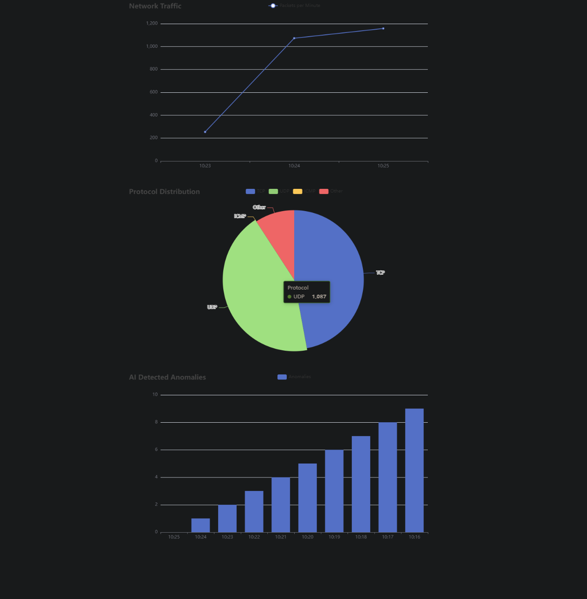

# 🚀 AI-Driven Network Forensics Tool 🛡️

Welcome to  **AI-Driven Network Forensics Tool** This tool uses new AI to check network activity as it happens, find anything odd, and give tips to cybersecurity professionals. 

  

## 🎯 Purpose

This project aims to make networks safer by using AI to spot unusual activities. The tool watches over the network all the time, spots anything odd, and quickly lets the user know. This way, it's simpler to quickly deal with any dangers and protect your network.

## 🛠️ Features

- **Real-Time Traffic Monitoring:** Keeps catching and showing what goes on in the network.
- **AI-Powered Anomaly Detection:** Uses ai to spot odd network actions.
- **Interactive Dashboard:** Shows network information and warnings on a clean, easy-to-use dashboard.
- **Customizable Filters:** Adjust settings to capture specific network traffic.

## ⚙️ Setup Instructions


### Prerequisites

- **Go Language** (version 1.16 or later)
- **Python** (version 3.8 or later)
- **Wireshark** (for packet capture)

### Installation

1. **Clone the Repository:**
   ```bash
   git clone https://github.com/blondon1/ai_driven_network_forensics_tool.git
   cd ai_driven_network_forensics_tool
   ```

2. **Install Dependencies:**
   - **Go Dependencies:**
     ```bash
     go mod tidy
     ```
   - **Python Dependencies:**
     ```bash
     pip install -r requirements.txt
     ```

3. **Set Up Configuration:**
   - Edit the `config/system_config.yaml` file to match your network settings.
   - Specify the network interface you want to monitor in the configuration file.

4. **Run the Tool:**
   ```bash
   go run main.go
   ```

5. **Access the Dashboard:**
   - Open your web browser and go to `http://localhost:8080` to view the interactive dashboard.

## 🧠 How It Works

The tool captures network packets using Go and processes them in real-time. This tool uses AI built with Python to spot unusual things in the traffic. It shows warnings on a dashboard screen you can see in your web browser.

## 📈 Future Enhancements

- **Expanded AI Capabilities:** Incorporate more advanced machine learning models.
- **Enhanced Visualizations:** Add more detailed and interactive charts.
- **Additional Protocol Support:** Extend the tool to monitor additional network protocols.

## 🤝 Contributions

Feel free to fork this repository and submit pull requests. Any contributions that make this tool even better are welcome!

## 📝 License

This project is licensed under the MIT License.